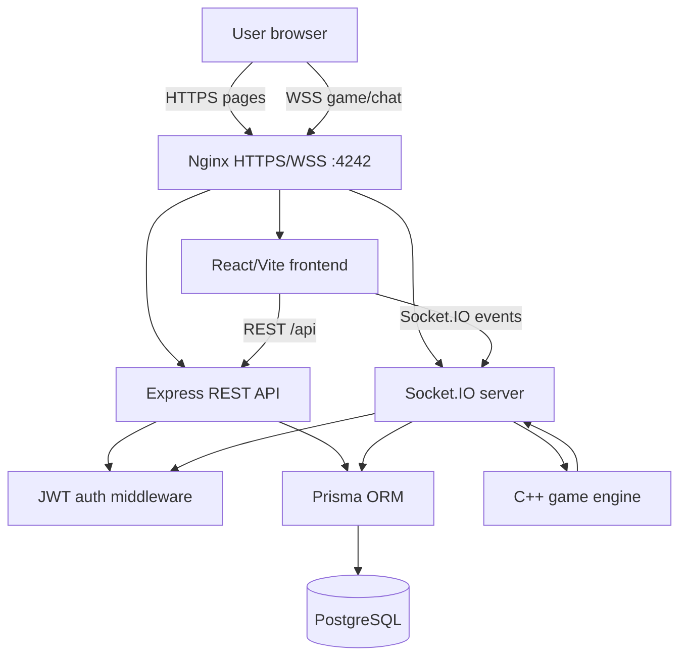

*This project has been created as part of the 42 curriculum by nicolsan, yaoberso, mm-furi, ylabussi, malapoug.*

# ft_transcendence

42 project.

Main goal:

- cooperative 2D multiplayer web game;
- real-time rooms and gameplay;
- user accounts and profiles;
- friends, chat, scores and history.

## Team

| Login | Main area |
|---|---|
| nicolsan | PM, Scrum Master, frontend UI, QA |
| yaoberso | Backend API, database, Prisma |
| mm-furi | WebSocket, rooms, multiplayer sync |
| ylabussi | Gameplay, C++ simulation |
| malapoug | Auth, users, scores |

## Run

Install:

- Git
- Docker Desktop
- Docker Compose
- Node.js LTS
- npm

Create `.env`:

```bash
cp .env.example .env
```

Then:

- fill required secrets;
- never commit `.env`.

Create HTTPS certs:

```bash
sh scripts/generate-dev-cert.sh
```

Start:

```bash
docker compose up -d --build
```

Open:

```txt
https://localhost:4242
```

Stop:

```bash
docker compose down
```

## Technologies

| Area | Tech | Role |
|---|---|---|
| Frontend | React + Vite | UI and pages |
| Styling | Bootstrap + custom CSS | UI base + game style |
| Backend | Express | REST API |
| Real-time | Socket.IO | rooms, chat, game sync |
| Database | PostgreSQL | persistent data |
| ORM | Prisma | schema and migrations |
| Proxy | Nginx | HTTPS entrypoint |
| Game | C++ | gameplay simulation |
| Deploy | Docker Compose | local multi-service run |

## Claimed Modules

The claimed modules are selected from the subject module list.

No custom module outside the subject list is claimed.

| Module | Type | Pts | Notes |
|---|---|---:|---|
| Complete web-based game | Major | 2 | Cooperative browser game with C++ simulation. |
| Remote players | Major | 2 | Players can join the same room from separate clients. |
| Multiplayer 3+ | Major | 2 | Rooms support up to 4 players. |
| Frontend + backend framework | Major | 2 | React frontend, Express backend and Prisma database layer. |
| Real-time WebSocket | Major | 2 | Socket.IO synchronizes rooms, chat and gameplay. |
| User interaction | Major | 2 | Profiles, friends, chat and rooms. |
| Standard user management | Major | 2 | Register, login, protected sessions, profile data and OAuth 42. |
| Game stats + history | Minor | 1 | Saved match history, leaderboard and profile statistics. |
| OAuth 42 | Minor | 1 | Additional login method using 42 OAuth. |
| ORM | Minor | 1 | Prisma schema, migrations and typed database access. |
| Game customization | Minor | 1 | Checkpoint upgrades modify gameplay during a run. |
| Gamification | Minor | 1 | Badges and progression are derived from player statistics. |

Possible static total:

- 7 Major = 14 pts.
- 5 Minor = 5 pts.
- Total possible = 19 pts.

## Project Documentation

- [Auth and User Management](docs/modules/auth-users.md)
- [Backend API and Database](docs/modules/backend-api-db.md)
- [Docker, Nginx and HTTPS](docs/modules/docker-nginx-https.md)
- [Frontend UI](docs/modules/frontend-ui.md)
- [Gameplay and Game Engine](docs/modules/gameplay-game-engine.md)
- [Lobby, Rooms and Chat](docs/modules/lobby-rooms-chat.md)
- [Privacy Policy and Terms of Service](docs/modules/privacy-terms.md)
- [Profiles and Friends](docs/modules/profiles-friends.md)
- [Real-time WebSocket](docs/modules/realtime-websocket.md)
- [Scores, Match History and Leaderboard](docs/modules/scores-history-leaderboard.md)

## Architecture



Main folders:

- `frontend/`: React app.
- `backend/`: API, Socket.IO, Prisma, game bridge.
- `game_engine/`: C++ simulation.
- `nginx/`: HTTPS proxy.
- `docs/`: project documentation.

## Technical Decisions

Main choices:

- React/Vite for browser UI and fast frontend iteration.
- Express for simple REST routes.
- Socket.IO for real-time rooms, chat and gameplay events.
- Prisma/PostgreSQL for relational data and persistent stats.
- Nginx for one HTTPS/WSS entrypoint.
- C++ for the game simulation.

Main trade-offs:

- validation consistency is manual;
- socket lifecycle must be verified in Chrome;
- C++ engine state must stay aligned with backend and frontend state;
- local HTTPS certificates may need browser acceptance.

## Database Schema

Schema:

- `backend/prisma/schema.prisma`

Models:

- `User`: username, email, password, OAuth id, avatar.
- `Room`: room owner and status.
- `RoomPlayer`: user in room, ready state.
- `RefreshToken`: token, expiry, revoked flag.
- `GameRun`: result, duration, room.
- `PlayerRunStats`: deaths, damage, gold, upgrades.

## Validation and Security

The backend is the source of truth for validation and authorization.

Frontend validation improves user experience, but protected actions are checked server-side.

Module details:

- [Auth and User Management](docs/modules/auth-users.md)
- [Backend API and Database](docs/modules/backend-api-db.md)
- [Lobby, Rooms and Chat](docs/modules/lobby-rooms-chat.md)
- [Real-time WebSocket](docs/modules/realtime-websocket.md)

## Privacy and Terms

- [Privacy Policy](docs/privacy-policy.md)
- [Terms of Service](docs/terms-of-service.md)
- [Privacy/Terms module notes](docs/modules/privacy-terms.md)

## Branch Workflow

Branches:

- `main`: stable demo/release.
- `dev`: integration.

Flow:

```txt
feature/... -> area/... -> dev -> main
```

Examples:

- `area/front`
- `area/backend-api-db`
- `area/websocket-multiplayer`
- `area/gameplay-cpp`
- `area/auth-users-scores`
- `area/docker-setup`

## AI Usage

AI tools were used as support.

Used for:

- planning;
- documentation;
- explanations;
- checklists;
- review support;
- test ideas;
- bug investigation;
- patch suggestions;
- learning examples.

Team responsibility:

- final features were chosen by the team;
- code was adapted to our project;
- final code must be understood by the team;
- the team remains responsible for the final project.
