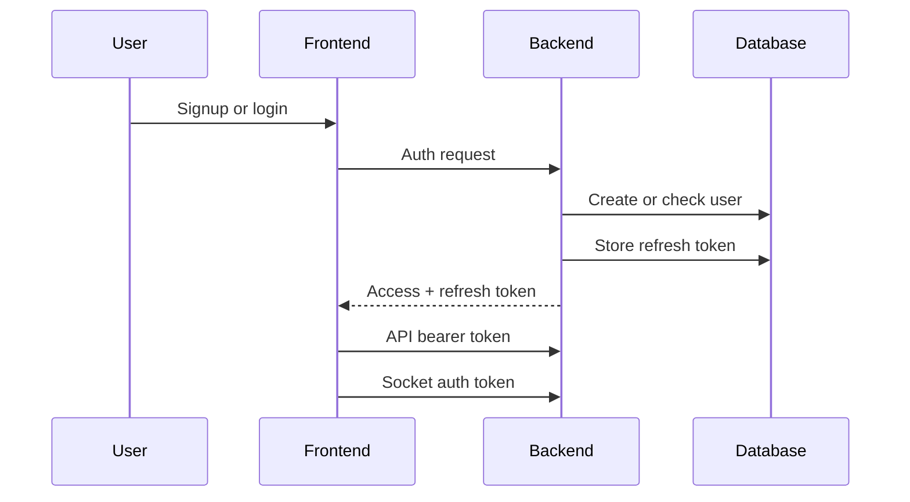

# Auth and User Management

## Goal

- create accounts;
- login users;
- protect private routes;
- keep sessions active;
- link users to rooms, friends and scores.

## What Exists

- password signup;
- password login;
- bcrypt password hashing;
- JWT access token;
- refresh token storage;
- refresh token rotation;
- logout token revocation;
- OAuth 42 login/linking.

## Flow

Signup:

- user submits username, email and password;
- backend creates a `User`;
- password is hashed;
- user is stored in PostgreSQL.

Login:

- user submits username and password;
- backend checks the user;
- backend compares password hash;
- backend returns tokens.

Session:

- frontend stores session data;
- API requests use bearer token;
- Socket.IO uses the access token.

## Key Files

- `backend/src/routes/register.js`
- `backend/src/routes/login.js`
- `backend/src/routes/logout.js`
- `backend/src/routes/token.js`
- `backend/src/middlewares/OAuth.js`
- `backend/src/middlewares/authToken.js`
- `backend/src/middlewares/socketAuth.js`
- `frontend/src/features/auth/DevLoginForm.jsx`
- `frontend/src/api/users.js`

## API Contracts

- `POST /api/register`
- `POST /api/login`
- `POST /api/token`
- `DELETE /api/logout`
- `GET /api/users/me`

## Validation

Automatic checks:

- required auth fields;
- password hash check;
- JWT required on protected routes;
- refresh token exists in database;
- refresh token is not revoked;
- Socket.IO token verification.

## Manual Checks

- register a user;
- login;
- load profile;
- refresh session;
- logout;
- try invalid credentials;
- test OAuth 42.

## Current Limitations

- auth form validation must be reviewed before final evaluation;
- OAuth 42 needs real credentials during demo.
