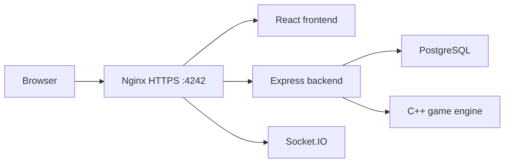

# Docker, Nginx and HTTPS

## Goal

- run all services with Docker;
- expose one HTTPS entrypoint;
- route frontend, API and Socket.IO.

## What Exists

- Docker Compose stack;
- frontend container;
- backend container;
- PostgreSQL container;
- Nginx reverse proxy;
- C++ game engine container;
- local cert generation script.

## Flow

- browser opens `https://localhost:4242`;
- Nginx receives HTTPS;
- `/` goes to frontend;
- `/api` goes to backend;
- `/socket.io` goes to backend Socket.IO;
- backend uses database and game engine.

## Key Files

- `docker-compose.yml`
- `nginx/default.conf`
- `scripts/generate-dev-cert.sh`
- `frontend/Dockerfile`
- `backend/Dockerfile`
- `game_engine/Dockerfile`

## Manual Checks

- generate certs;
- run Docker Compose;
- open `https://localhost:4242`;
- check `/api/health`;
- login;
- verify Socket.IO connection;
- start a game.

## To Verify

- clean-machine startup;
- HTTPS in Chrome;
- WSS in Chrome;
- network access for remote players.
