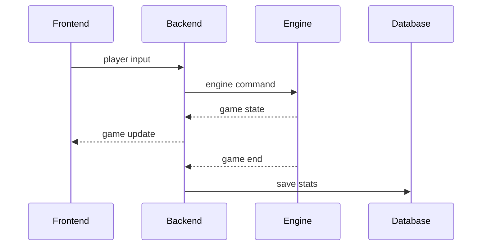

# Gameplay and Game Engine

## Goal

- run the game loop;
- simulate gameplay in C++;
- send live state to frontend;
- save game results.

## What Exists

- C++ game engine;
- player movement;
- melee attack;
- ranged attack;
- shield;
- checkpoint upgrades;
- health upgrade;
- gold;
- enemies;
- boss;
- sprite-based rendering;
- player and enemy animation states;
- game end state.

## Flow

- room starts game;
- backend starts engine session;
- frontend sends player inputs;
- backend maps user to engine player;
- engine updates simulation;
- backend receives game state;
- frontend renders canvas;
- frontend selects sprites and animation frames;
- backend saves final stats.

## Key Files

- `game_engine/src/`
- `backend/src/services/gameEngineService.js`
- `backend/src/services/gameService.js`
- `backend/src/socket/socketHandler.js`
- `frontend/src/pages/GamePage.jsx`
- `frontend/src/features/game/`
- `frontend/src/assets/game/`

## Socket Events

- `game:start`
- `game:state:init`
- `game:state:update`
- `game:end`
- `game:error`
- `player:input`
- `checkpoint:upgrade`

## Manual Checks

- start game;
- move player;
- use melee;
- use ranged;
- use shield;
- buy checkpoint upgrades;
- verify idle, walk and attack sprites;
- finish a game;
- verify stats are saved.

## To Verify

- collision behavior;
- 3-4 player gameplay;
- disconnect during game;
- win and loss paths.
