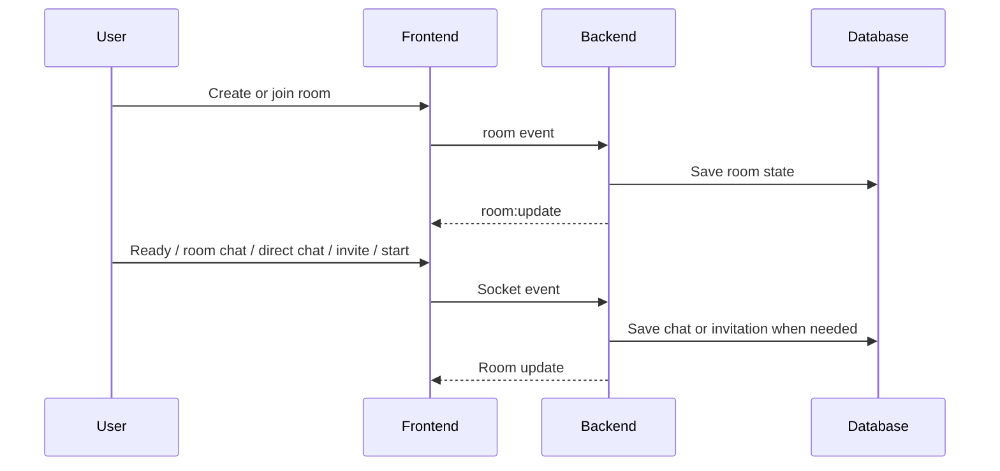

# Lobby, Rooms and Chat

## Goal

- create rooms;
- join rooms;
- manage ready state;
- start games;
- chat in a room.

## What Exists

- lobby page;
- room page;
- room creation;
- join by room id or name;
- max 4 players;
- ready toggle;
- room chat;
- room chat history;
- direct chat;
- game invitations;
- user blocking for direct chat;
- leave room;
- room cleanup.

## Flow

Room:

- user logs in;
- user opens lobby;
- user creates or joins room;
- backend stores room state;
- Socket.IO sends `room:update`;
- frontend shows room state.

Chat:

- user sends message;
- backend checks room membership;
- message is emitted to room members.

Start:

- players toggle ready;
- backend checks ready state;
- game starts.

## Key Files

- `backend/src/socket/rooms.js`
- `backend/src/socket/socketHandler.js`
- `backend/src/socket/handlers/roomHandlers.js`
- `backend/src/socket/handlers/chatHandlers.js`
- `backend/src/services/chatService.js`
- `frontend/src/features/room/useRoom.js`
- `frontend/src/features/chat/`
- `frontend/src/pages/LobbyPage.jsx`
- `frontend/src/pages/RoomPage.jsx`

## Socket Events

- `room:create`
- `room:created`
- `room:join`
- `room:update`
- `room:error`
- `room:leave`
- `room:removed`
- `player:ready`
- `chat:message`
- `chat:history:request`
- `chat:history`
- `chat:direct:message`
- `chat:direct:history:request`
- `chat:direct:history`
- `chat:direct:conversations:request`
- `chat:direct:conversations`
- `chat:invitation:send`
- `chat:invitation:list:request`
- `chat:invitation:list`
- `chat:invitation:respond`
- `chat:invitation:update`
- `chat:block`
- `chat:unblock`
- `chat:blocked:request`
- `chat:blocked`
- `chat:block:update`
- `game:start`

## Validation

Automatic checks:

- room name required;
- room id/name required to join;
- full room is rejected;
- duplicate room membership is handled;
- chat requires room membership;
- empty chat message is rejected.
- direct chat rejects blocked users.

## Manual Checks

- create room;
- join room from another account;
- send chat;
- toggle ready;
- start game;
- leave room;
- test full room with 4 players.

## To Verify

- multi-browser room updates;
- disconnect cleanup;
- room full message in UI.
