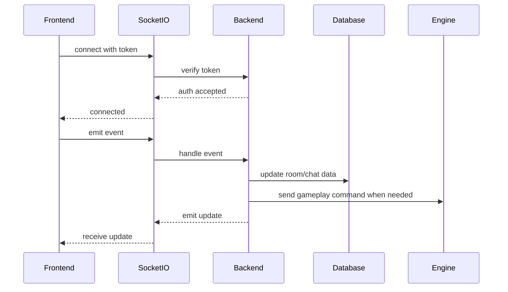

# Real-time WebSocket

## Goal

- synchronize rooms;
- synchronize chat;
- synchronize ready state;
- synchronize game state.

## What Exists

- Socket.IO server;
- Socket.IO client;
- JWT socket auth;
- room events;
- chat events;
- direct chat events;
- game invitation events;
- game events;
- reconnect/resync path;
- token refresh and reconnect path for expired access tokens.

## Flow

Connection:

- user logs in;
- frontend creates socket;
- access token is sent in `auth.token`;
- backend verifies token;
- backend assigns `socket.user`.
- if the token is expired, frontend refreshes the session and reconnects.

Events:

- frontend emits event;
- backend validates payload;
- backend updates room, database or engine;
- backend emits update;
- frontend updates UI.

## Key Files

- `backend/src/middlewares/socketAuth.js`
- `backend/src/socket/connections.js`
- `backend/src/socket/socketHandler.js`
- `backend/src/socket/handlers/connectionHandlers.js`
- `backend/src/socket/handlers/roomHandlers.js`
- `backend/src/socket/handlers/chatHandlers.js`
- `backend/src/socket/handlers/gameHandlers.js`
- `frontend/src/app.jsx`
- `frontend/src/features/room/useRoom.js`
- `frontend/src/features/chat/useChat.js`
- `frontend/src/features/chat/useDirectChat.js`
- `frontend/src/features/game/usePlayerInput.js`

## Socket Events

- `connection:replaced`
- `room:create`
- `room:join`
- `room:update`
- `room:error`
- `chat:message`
- `chat:history:request`
- `chat:history`
- `chat:direct:message`
- `chat:direct:history:request`
- `chat:direct:history`
- `chat:direct:conversations:request`
- `chat:direct:conversations`
- `chat:invitation:send`
- `chat:invitation:list:request`
- `chat:invitation:list`
- `chat:invitation:respond`
- `chat:invitation:update`
- `chat:block`
- `chat:unblock`
- `chat:blocked:request`
- `chat:blocked`
- `chat:block:update`
- `player:ready`
- `game:start`
- `game:resync`
- `game:state:init`
- `game:state:update`
- `game:end`
- `game:error`
- `checkpoint:upgrade`
- `checkpoint:error`
- `player:input`
- `connect_error` auth codes: `ACCESS_TOKEN_MISSING`, `ACCESS_TOKEN_INVALID`, `ACCESS_TOKEN_EXPIRED`

## Validation

Automatic checks:

- missing token rejected;
- invalid token rejected;
- room payloads checked;
- player membership checked;
- player input checked.

## Manual Checks

- login;
- verify socket connects;
- create room;
- join from another client;
- send chat;
- start game;
- disconnect/reconnect;
- verify resync;
- verify WSS in Chrome.

## Current Limitations

- browser console must be checked;
- debug latency logs should be removed before final evaluation.
